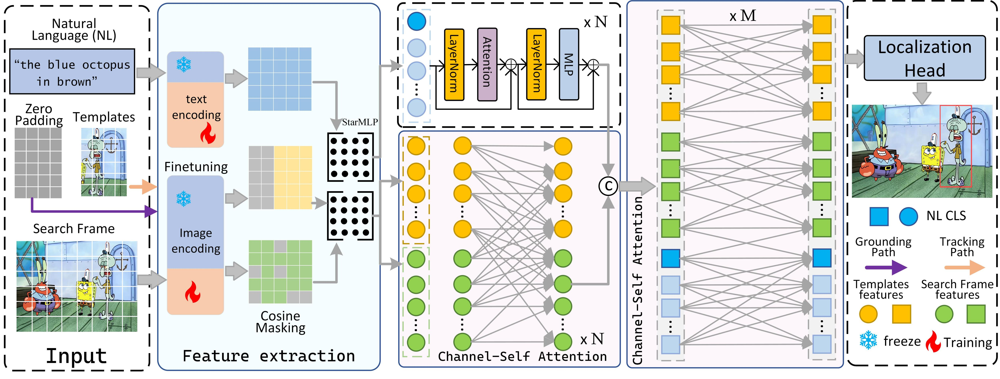

# LiteTrack
# Unifying Visual and Vision-Language Tracking via Contrastive Learning



## Abstract
Visual target tracking tasks based on natural language descriptions aim to consistently localize a specified target in a video sequence through semantic representations. However, existing methods suffer from key issues such as inefficient multimodal feature fusion, computational redundancy in cross-modal interactions, and limited deployment. To address these issues, we propose an efficiency-challenged tracking approach on visual language tracking models called LiteTrack.First, we design a hierarchical dynamic parameter-freezing visual feature encoder, demonstrating that fine-tuning of text enhancement effectively reduces text bias. Mathematical modeling is used to achieve the optimal balance between bottom-level generic feature maintenance and high-level task-specific feature adaptation; since the Visual Encoder is called only once at the beginning of the process, the computation has quadratic complexity with respect to the number of VLM input tokens, we propose a cosine-similarity-based adaptive Token selection strategy, which, through a learnable dynamic thresholding mechanism, significantly improve the efficiency in terms of speed and memory; finally, we design a lightweight Channel Self-Attention Module (CSA) that allows high-level semantic interactions for target localization and improves the expressiveness and stability of the network. Experimental results show that LiteTrack is tested on benchmark datasets such as LaSOT, TNL2K, etc., and this method improves SOTA accuracy while training inference speedups by close to 8 FPS in a single RTX 3090 GPU and reduces the graphics memory footprint by 20%, providing an innovative solution for natural language-guided tracking systems in resource-constrained devices.

### Computational Efficiency
| Metric    | Sub-Metric | VLTVG+STARK  | VLTVG+OSTrack  | SepRM | JointNLT  | UVLTrack | LiteTrack |
|-----------|------------|--------------|-----------------|-------|-----------|------|----------|
| **FLOPs** | Grounding  | 39.6G        | 39.6G           | 34.7G | 34.9G     | 36.7 | **39.8** |
|           | Tracking   | 20.4G        | 48.3G           | 38.5G | 42.0G     | 43.7 | **47.2** |
| **FPS**   | Grounding  | 35.4         | 35.4            | 37.8  | 28.7      | 35.2 | **43.3** |
|           | Tracking   | 43.6         | 120.4           | 48.5  | 39.2      | 44.1 | **51.7** |

### Accuracy
| Metric | Dataset | VLTVG+STARK | VLTVG+OSTrack | SepRM | JointNLT | UVLTrack | LiteTrack |
|--------|---------|-------------|----------------|-------|----------|-----|-----------|
| **AUC**| LaSOT   | 44.6        | 52.4           | 51.8  | 58.8     | 66.4| **70.3**  |
|        | TNL2K   | 37.3        | 39.9           | 41.9  | 56.6     | 55.3 | **57.0**  |

### Resource Usage
| Metric       | Sub-Metric | VLTVG+STARK | VLTVG+OSTrack | SepRM | JointNLT  | UVLTrack | LiteTrack |
|--------------|------------|-------------|----------------|-------|-----------|----------|-----------|
| **Params**   | Total      | 169.8M      | 214.7M         | 214.4M | 153.0M    | 167.7M   | **108.4M**|
| **GPU memory**| Total     | -           | -              | -     | 88%       | 90%      | **70%**   |

## Strong Performance

We test on three challenging datasets, OTB99, TNL2K, and LASOT, where the main challenging attributes of these datasets are in order of multiple complex scenarios such as fast motion, occlusion, and appearance changes. Our approach demonstrates enhanced target-aware localization and robust discrimination capabilities. Specifically, our model is able to consistently focus on real target objects while effectively suppressing interfering objects, thus predicting more accurate bounding boxes. This advantage is particularly evident in complex scenes. For example, in sequences where JointNLT fails to accurately predict the target frame, SNLT , SiamRPN++ and Ocean gradually predict inaccurate target frames as the target appearance changes. In contrast, our method is able to predict the target frame more accurately, further confirming the generalization ability and practical applicability of our method in visual-verbal tracking tasks


## Install the environment
Use the Anaconda
```
conda create -n LiteTrack python=3.6
conda activate LiteTrack
cd LiteTrack
pip install -r requirements.txt
```

## Data Preparation
Put the tracking datasets in ./data. It should look like:
   ```
   ${LiteTrack_ROOT}
    -- data
        -- lasot
            |-- airplane
            |-- basketball
            |-- bear
            ...
        -- lasotext
            |-- atv
            |-- badminton
            |-- cosplay
            ...
        -- got10k
            |-- test
            |-- train
            |-- val
        -- coco
            |-- annotations
            |-- train2017
        -- trackingnet
            |-- TRAIN_0
            |-- TRAIN_1
            ...
            |-- TRAIN_11
            |-- TEST
        -- otb99
            |-- OTB_query_test
            |-- OTB_query_train
            |-- OTB_videos
        -- refcocog
            |-- refcocog
            |-- split # download this folder from VLTVG (https://github.com/yangli18/VLTVG/blob/master/docs/get_started.md)
            |-- train2014 # coco 2014
            |-- val2014 # coco 2014
        -- tnl2k
            |-- test
            |-- train
   ```

## Train LiteTrack
Download the pretrained [MAE](https://github.com/facebookresearch/mae) and [BERT](https://drive.google.com/drive/folders/1UZTrGcL3YlxvNpHi0wKsO_sKsTYuYnFo?usp=sharing), put it under ```<PROJECT_ROOT>/pretrain```.

Training with multiple GPUs using DDP.
```
# LiteTrack
python tracking/train.py  baseline_base
```

## Evaluation

Put the downloaded weights on ```<PROJECT_ROOT>/checkpoints/train/LiteTrack/baseline_base```.

Notably, the modality of target reference (NL, BBOX or NLBBOX) is specified in config ```TEST.MODE```

```
# Testing
python tracking/test.py  baseline_base <dataset_name> <num_threads_per_gpu> <num_gpu>

# Evaluation
python tracking/analysis_results.py  --tracker_param baseline_base --dataset_name <dataset_name>_<reference_modality>_<EPOCH>

# Example
python tracking/test.py  baseline_base otb99 4 2
python tracking/analysis_results.py  --tracker_param baseline_base --dataset_name otb99_NL_300
```

## Run LiteTrack on your own video
Specify the target by bounding box or natural language, which should keep consistent with ```TEST.MODE``` in config.
```
python demo.py baseline_base \
                   <input video path> \
                   <output video path> \
                   <language description of target> \
                   <initial bbox of target: x y w h>
```


## Contact
For questions about our paper or code, please contact [Lingling Yang(yanglingling1214@163.com)

## Acknowledgments
* Thanks for JointNLT and UVLTrack Library, which helps us to quickly implement our ideas.

* We use the implementation of the ViT from the [Timm](https://github.com/huggingface/pytorch-image-models) repo and BERT from the [pytorch_pretrained_bert](https://github.com/Meelfy/pytorch_pretrained_BERT).


